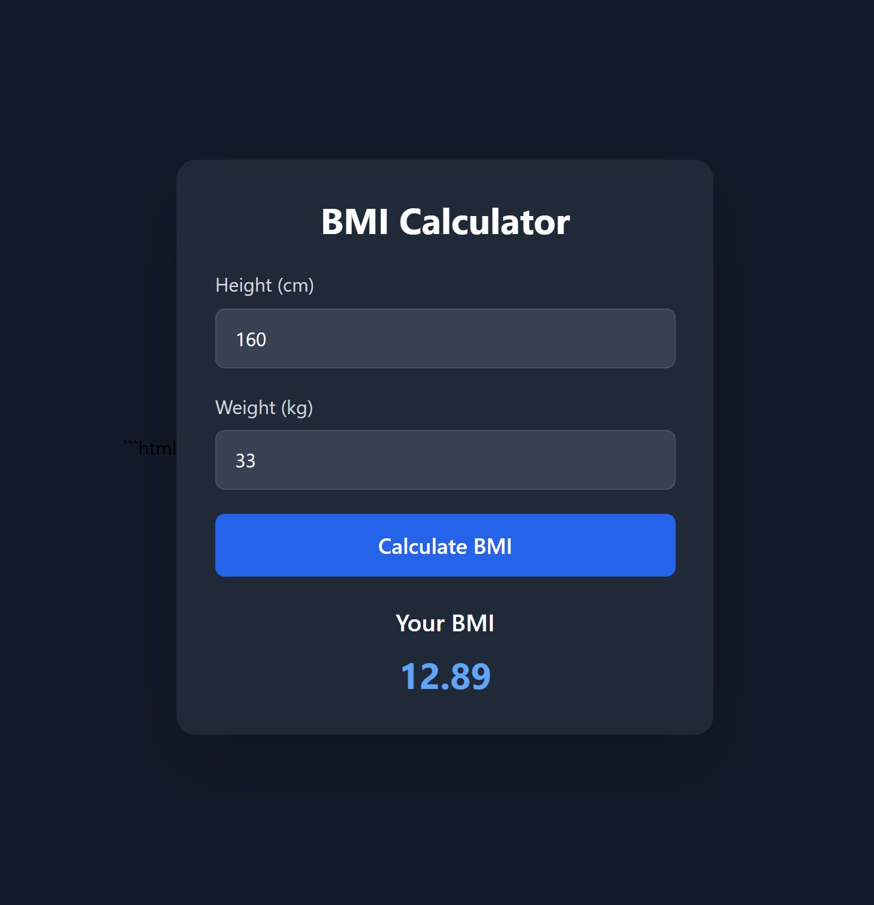

# BMI Calculator 🧮

A simple and responsive **BMI (Body Mass Index) Calculator** built using **HTML, JavaScript, and Tailwind CSS**.

The application takes the user's height and weight and calculates their BMI instantly.



## 🚀 Features

* Calculate BMI using height and weight
* Input validation for invalid values
* Displays BMI up to 2 decimal places
* Responsive design
* Clean and simple user interface
* Styled using Tailwind CSS
* Beginner-friendly JavaScript

## 🛠️ Technologies Used

* **HTML5** – Structure of the application
* **JavaScript** – BMI calculation and validation
* **Tailwind CSS** – Styling and responsive design

## 📐 BMI Formula

The BMI is calculated using:

```text
BMI = weight (kg) / height² (m²)
```

Since the height is entered in centimeters, the JavaScript converts it to meters:

```javascript
const bmi = (weight / ((height * height) / 10000)).toFixed(2);
```

## 📊 BMI Categories

| BMI         | Category      |
| ----------- | ------------- |
| Below 18.5  | Underweight   |
| 18.5 – 24.9 | Normal Weight |
| 25 – 29.9   | Overweight    |
| 30 or above | Obesity       |

> **Note:** BMI is a general screening measure and does not account for factors such as muscle mass, age, or body composition.

## 💻 How It Works

1. Enter your **height in centimeters**.
2. Enter your **weight in kilograms**.
3. Click the **Calculate BMI** button.
4. The JavaScript calculates your BMI.
5. The result is displayed on the screen.

## 🔮 Future Improvements

* Add BMI category messages.
* Add different colors for each BMI category.
* Add a reset button.
* Improve animations and UI.
* Add dark/light mode.
* Add BMI history.

## 👩‍💻 Author

**Janvi Chauhan**

---

⭐ If you like this project, consider giving the repository a star!
